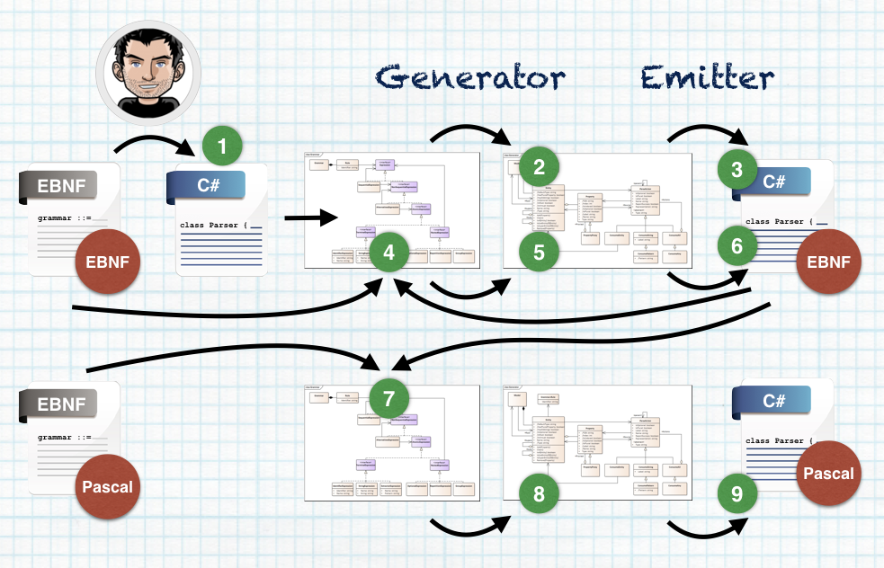
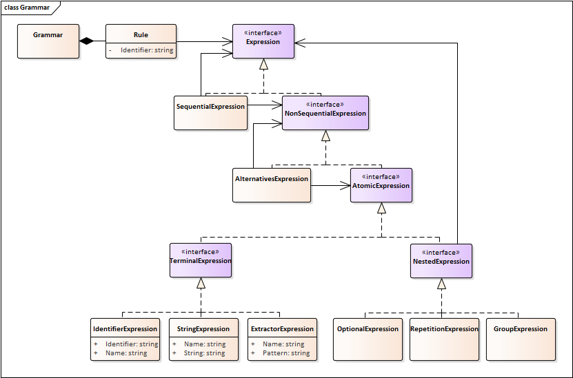
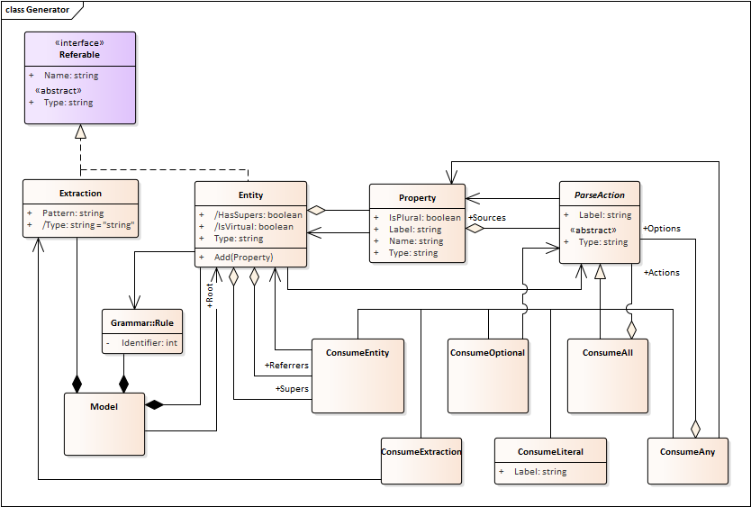
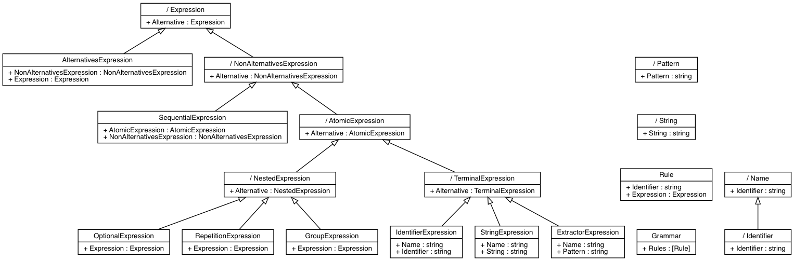
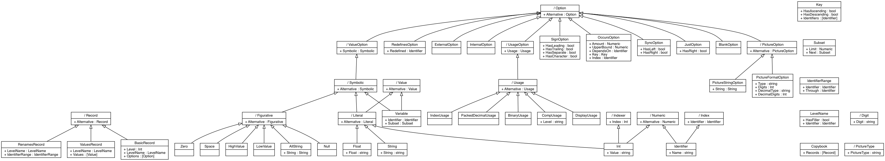

# Human Parser Generator

A simple Parser Generator with a focus on "human" code generation    
Christophe VG (<contact@christophe.vg>)  
[https://github.com/christophevg/cs-parser-generator](https://github.com/christophevg/cs-parser-generator)

# Introduction

Although many parser generators exist, I feel like there is room for one more, which generates a parser in a more "human" way.

The objectives are:

* start from an EBNF-like notation, e.g. allow copy pasting existing grammars and (maybe almost) be done with it.
* generate code, as if it were written by a human developer:
	* generate functional classes to construct the AST
	* generate parser logic that is readable and understandable
* be self hosting: the project should be able to generate itself.

The project will initially target C#. No other target language is planned at this point.

**Disclaimer** I'm not aiming for feature completeness and only add support for what I need at a given time ;-)

## Current Status

As of February 18, I tagged the repository `v1.0`. At that point I felt that the current code base was capable of fulfilling the objectives I had set forward at the beginning:

* A trivial example of a small subset of the Pascal language can be parsed.
* The generator is capable of generating a parser for its own EBNF-like definition language, which means its self-hosting (see also below for more information on this feature). 
* A parser for a more complex grammar for Cobol record definitions (aka Copybooks) is capable of parsing a set of example Copybooks and outputs a nice corresponding parser.

Since then I've started working on improving things that didn't turn out the way I wanted or expected:

* The emitted generator became less _human_ with more complex grammars, such as the one for Cobol Copybooks. Especially the nested `try { ... } catch { ... }` blocks were no longer nice on the eye and hard to read. So I started implementing an inner-DSL. See below for more info.
* Error reporting was not so "useful". Towards `v1.1` I'm aiming for much improved error reporting. See below for more info.

## Example

The following example is taken from [the Wikipedia page on EBNF](https://en.wikipedia.org/wiki/Extended_Backus–Naur_form):

```ebnf
(* a simple program syntax in EBNF − Wikipedia *)
 program = 'PROGRAM', white space, identifier, white space, 
            'BEGIN', white space, 
            { assignment, ";", white space }, 
            'END.' ;
 identifier = alphabetic character, { alphabetic character | digit } ;
 number = [ "-" ], digit, { digit } ;
 string = '"' , { all characters - '"' }, '"' ;
 assignment = identifier , ":=" , ( number | identifier | string ) ;
 alphabetic character = "A" | "B" | "C" | "D" | "E" | "F" | "G"
                      | "H" | "I" | "J" | "K" | "L" | "M" | "N"
                      | "O" | "P" | "Q" | "R" | "S" | "T" | "U"
                      | "V" | "W" | "X" | "Y" | "Z" ;
 digit = "0" | "1" | "2" | "3" | "4" | "5" | "6" | "7" | "8" | "9" ;
 white space = ? white space characters ? ;
 all characters = ? all visible characters ? ;
```

This grammar would allow to parse

```pascal
 PROGRAM DEMO1
 BEGIN
   A:=3;
   B:=45;
   H:=-100023;
   C:=A;
   D123:=B34A;
   BABOON:=GIRAFFE;
   TEXT:="Hello world!";
 END.
```

### Changes, Simplifications, Extensions,...

To get a head-start I've added few changes/extensions/limitations to the standard EBNF notation. The following grammar is a rewritten version of the earlier Pascal example, using these extensions:

```ebnf
program               ::= "PROGRAM" identifier
                          "BEGIN"
                          { assignment }
                          "END."
                        ;

assignment            ::= identifier ":=" expression ";" ;

expression            ::= identifier
                        | string
                        | number
                        ;

identifier            ::= name  @ /([A-Z][A-Z0-9]*)/ ;
string                ::= text  @ /"([^"]*)"|'([^']*)'/ ;
number                ::= value @ /(-?[1-9][0-9]*)/ ;
```

The extensions that are applied are:

* abandoned `,` (colon) in sequences of consecutive expressions
* spaces in rule names (left hand side) are not allowed (e.g. use dashes)
* ignoring whitespace, removing the need for explicit whitespace description
* definition of "extracting terminals" using regular expressions
* introduction of _implicit_ "virtual" entities, which don't show up in the AST (`expression` is an example)

## Demos

A few demos show the capabilities and results of the generated parsers.

### Pascal

In the [`example/pascal`](example/pascal) folder I've started by writing a manual implementation for the embryonal Pascal example, [`pascal.cs`](example/pascal/pascal.cs), taking into account how I think this could be generated. The output of the example program, parses the example Pascal file and outputs an AST-like structure.

```bash
$ cd example/pascal

$ make run-manual
*** compiling manual.exe from ../../generator/dump-ast.cs ../../generator/parsable.cs pascal.cs
*** running manual Pascal parser
Program(Identifier=Identifier(Name=DEMO1),Assignments=[Assignment(Identifier=Identifier(Name=A),Expression=Number(Value=3)),Assignment(Identifier=Identifier(Name=B),Expression=Number(Value=45)),Assignment(Identifier=Identifier(Name=H),Expression=Number(Value=-100023)),Assignment(Identifier=Identifier(Name=C),Expression=Identifier(Name=A)),Assignment(Identifier=Identifier(Name=D123),Expression=Identifier(Name=B34A)),Assignment(Identifier=Identifier(Name=BABOON),Expression=Identifier(Name=GIRAFFE)),Assignment(Identifier=Identifier(Name=TEXT),Expression=String(Text=Hello world!))])
```

> The manual implementation uses two supporting files, that are now part of the generator framework. They were "promoted" from the manual example to the actual framework.

The Makefile also implements an example on how to generate a Pascal generator from the EBNF-like language definition. In fact, just issuing `make` runs the manual implementation, generates a fresh Pascal parser, compares the manual and generated parser and finally also runs the generated version:

```bash
$ make
*** compiling manual.exe from ../../generator/dump-ast.cs ../../generator/parsable.cs pascal.cs
*** running manual Pascal parser
Program(Identifier=Identifier(Name=DEMO1),Assignments=[Assignment(Identifier=Identifier(Name=A),Expression=Number(Value=3)),Assignment(Identifier=Identifier(Name=B),Expression=Number(Value=45)),Assignment(Identifier=Identifier(Name=H),Expression=Number(Value=-100023)),Assignment(Identifier=Identifier(Name=C),Expression=Identifier(Name=A)),Assignment(Identifier=Identifier(Name=D123),Expression=Identifier(Name=B34A)),Assignment(Identifier=Identifier(Name=BABOON),Expression=Identifier(Name=GIRAFFE)),Assignment(Identifier=Identifier(Name=TEXT),Expression=String(Text=Hello world!))])
make[1]: Nothing to be done for `all'.
*** generating a Pascal parser from pascal-assignments.bnf
*** comparing to manual version
    manual and generated parsers are identical
*** setting up generated environment for generated/pascal.cs
total 24
-rw-r--r--@ 1 xtof  staff   400 Feb 19 00:09 Makefile
-rw-r--r--  1 xtof  staff  5926 Feb 19 00:09 pascal.cs
*** compiling and running generated/pascal.cs
*** compiling dump-ast.exe from ../../../generator/dump-ast.cs ../../../generator/parsable.cs pascal.cs
*** running dump-ast.exe
Program(Identifier=Identifier(Name=DEMO1),Assignments=[Assignment(Identifier=Identifier(Name=A),Expression=Number(Value=3)),Assignment(Identifier=Identifier(Name=B),Expression=Number(Value=45)),Assignment(Identifier=Identifier(Name=H),Expression=Number(Value=-100023)),Assignment(Identifier=Identifier(Name=C),Expression=Identifier(Name=A)),Assignment(Identifier=Identifier(Name=D123),Expression=Identifier(Name=B34A)),Assignment(Identifier=Identifier(Name=BABOON),Expression=Identifier(Name=GIRAFFE)),Assignment(Identifier=Identifier(Name=TEXT),Expression=String(Text=Hello world!))])
```

### Cobol Example

In [`example/cobol`](example/cobol) a parser is generated for Cobol record definitions, also known as Copybooks - Warning: this is work in progress. The generated parser is currently capable of parsing several example Copybooks, but needs some EBNF-like definition rewriting to get the full potential. A few unit tests are the beginning to get this in motion:

```bash
$ make
*** building parser.gen1.cs
*** compiling hpg.exe from generator.cs emitter.cs grammar.cs bootstrap.cs
*** generating parser from hpg.bnf to parser.gen1.cs
*** building parser.cs
*** compiling hpg.exe from generator.cs emitter.cs parsable.cs parser.gen1.cs hpg.cs
*** generating parser from hpg.bnf to parser.cs
*** compiling hpg.exe from generator.cs emitter.cs parsable.cs parser.cs hpg.cs
*** generating a Cobol parser from cobol-record-definition.bnf
~~~ C# Emitter Warning: rewriting property name: float
~~~ C# Emitter Warning: rewriting property name: float
~~~ C# Emitter Warning: rewriting property name: string
~~~ C# Emitter Warning: rewriting property name: string
~~~ C# Emitter Warning: rewriting property name: float
~~~ C# Emitter Warning: rewriting property name: string
*** building unit tests
*** executing unit tests
....
Tests run: 4, Failures: 0, Not run: 0, Time: 0.341 seconds
```

The Makefile also provides a more visible demo that parses a small fragment of a Cobol copybook:

```cobol
01 TOP.
  05 SUB.
    10 FIELD   PIC S9(05) COMP-5.
```

```bash
$ make parse
*** building parser.gen1.cs
*** compiling hpg.exe from generator.cs emitter.cs grammar.cs bootstrap.cs
*** generating parser from hpg.bnf to parser.gen1.cs
*** building parser.cs
*** compiling hpg.exe from generator.cs emitter.cs parsable.cs parser.gen1.cs hpg.cs
*** generating parser from hpg.bnf to parser.cs
*** compiling hpg.exe from generator.cs emitter.cs parsable.cs parser.cs hpg.cs
*** generating a Cobol parser from cobol-record-definition.bnf
~~~ C# Emitter Warning: rewriting property name: float
~~~ C# Emitter Warning: rewriting property name: float
~~~ C# Emitter Warning: rewriting property name: string
~~~ C# Emitter Warning: rewriting property name: string
~~~ C# Emitter Warning: rewriting property name: float
~~~ C# Emitter Warning: rewriting property name: string
*** building parse-cobol.exe from ../../generator/parsable.cs ../../generator/dump-ast.cs cobol.cs
*** running parse-cobol.exe
Copybook(
Records=[
         BasicRecord(
         Level=Int(
              Value=01
              ),
         LevelName=LevelName(
                  HasFiller=False,
                  Identifier=Identifier(
                             Name=TOP
                             )
                  ),
         Options=[
                ]
         ),
         BasicRecord(
         Level=Int(
              Value=05
              ),
         LevelName=LevelName(
                  HasFiller=False,
                  Identifier=Identifier(
                             Name=SUB
                             )
                  ),
         Options=[
                ]
         ),
         BasicRecord(
         Level=Int(
              Value=10
              ),
         LevelName=LevelName(
                  HasFiller=False,
                  Identifier=Identifier(
                             Name=FIELD
                             )
                  ),
         Options=[
                PictureFormatOption(
                Type=S9,
                Digits=Int(
                       Value=05
                       ),
                DecimalType=,
                DecimalDigits=
                ),
                CompUsage(
                Level=5
                )]
         )]
)
```

> As shown by the output from the examples, the generator first generates two copies of itself, before the examples use it to generate a Pascal or Cobol parser. This is the implementation of the *self-hosting objective*.

## Being Self Hosting

An important aspect of this project is being self hosting and parsing the EBNF-like grammars with a parser that is generated by the parser generator itself. The following diagram shows what I mean by this; it shows the 9 steps to get from *no parser* to a fully generated second generation EBNF-like parser, that can be used to generate a parser for a different language, e.g. Pascal:



1. Human encoding of EBNF to loadable C# code
2. Importing of the Grammar and transformation to a Parser model
3. Emission of Generation 1 EBNF Parser
4. Using Generation 1 Parser, parsing of EBNF definition into Grammar parse tree
5. Importing of the Grammar and transformation to a Parser model
6. Emission of Generation 2 EBNF Parser
7. Using Generation 2 Parser, parsing of Pascal definition into Grammar parse tree
8. Importing of the Grammar and transformation to a Parser model
9. Emission of Pascal Parser

## Grammar

The grammar for the Human Parser Generator BNF-like notation (currently) looks like this:

```ebnf
grammar                   ::= { rule } ;

rule                      ::= identifier "::=" expression ";" ;

expression                ::= sequential-expression
                            | non-sequential-expression
                            ;

sequential-expression     ::= non-sequential-expression expression ;

non-sequential-expression ::= alternatives-expression
                            | atomic-expression
                            ;

alternatives-expression   ::= atomic-expression "|" non-sequential-expression ;


atomic-expression         ::= nested-expression
                            | terminal-expression
                            ;

nested-expression         ::= optional-expression
                            | repetition-expression
                            | group-expression
                            ;

optional-expression       ::= "[" expression "]" ;
repetition-expression     ::= "{" expression "}" ;
group-expression          ::= "(" expression ")" ;

terminal-expression       ::= identifier-expression
                            | string-expression
                            | extractor-expression
                            ;

identifier-expression     ::= [ name ] identifier ;
string-expression         ::= [ name ] string;

extractor-expression      ::= [ name ] "/" pattern "/" ;

name                      ::= identifier "@" ;

identifier                ::= /([A-Za-z_][A-Za-z0-9-_]*)/ ;
string                    ::= /"([^"]*)"|^'([^']*)'/ ;
pattern                   ::= /(.*?)(?<keep>/\s*;)/ ;
```

To bootstrap the generator, to allow it to generate a parser for the EBNF-like definition language, a grammar modelled by hand is used. It is located in `generator/grammar.cs` in the `AsModel` class, retrievable via the `BNF` property.

The model is a direct implementation of this EBNF-like definition in object-oriented structures and looks like this:



Not shown in the model are `identifier`, `string` and `regex`. These lowest-level, extracting entities, are not generated as classes, but as (static) prepared regular expressions, and used when needed.

## Generator

The generator accepts a Grammar Model, which is basically an Abstract Syntax Tree (AST), and first transforms this, to a Parser Model. This model is a rewritten version of the Grammar Model and is designed to facilitate the emission of the actual Parser code.

The structure of the Generator (currently) looks like this:



### Building `hpg.exe`

Building the generator simply requires a `make` command in the [`generator`](generator) folder - which is what is also done by the Pascal and Cobol examples above:

```bash
$ make
*** building parser.gen1.cs
*** compiling hpg.exe from generator.cs emitter.cs grammar.cs bootstrap.cs
*** generating parser from hpg.bnf to parser.gen1.cs
*** building parser.cs
*** compiling hpg.exe from generator.cs emitter.cs parsable.cs parser.gen1.cs hpg.cs
*** generating parser from hpg.bnf to parser.cs
*** compiling hpg.exe from generator.cs emitter.cs parsable.cs parser.cs hpg.cs
```

This compiles a second generation parser generator, called `hpg.exe`:

```bash
$ mono hpg.exe --help
Usage: hpg.exe [options] [file ...]

    --help, -h              Show usage information

Output options.
Select one of the following:
    --parser, -p            Generate parser (DEFAULT)
    --ast, -a               Show AST
    --model, -m             Show parser model
Formatting options.
    --text, -t              Generate textual output (DEFAULT).
    --dot, -d               Generate Graphviz/Dot format output. (model)
Emission options.
    --info, -i              Suppress generation of info header
    --namespace, -n NAME    Embed parser in namespace
```

Providing it with an EBNF-like language definition, will simple generate a corresponding parser to standard output:

```bash
$ mono hpg.exe ../example/pascal/pascal-assignments.bnf 
// parser.cs

// DO NOT EDIT THIS FILE
// This file was generated using the Human Parser Generator (https://github.com/christophevg/human-parser-generator)


using System;
using System.IO;
using System.Collections.Generic;
using System.Text.RegularExpressions;
using System.Linq;
using System.Diagnostics;


public class Program {
public Identifier Identifier { get; set; }
public List<Assignment> Assignments { get; set; }
  public Program() {
...
```

> If no `file` is provided, input is read from standard input.

#### Graphviz/Dot support

The parser model can be dumped and formatted in [Graphviz/Dot](http://graphviz.org) format, which is often an great tool while restructuring/rewriting the EBNF to obtain a nicer class model.

The output is generated, so it isn't as attractive as manually laid out diagrams, but still very useful. A few examples:

#### ENBF


#### Pascal


#### Cobol


### Test Driven Development

To be able to focus on sub-problems and isolate combinations of constructs, I've set up a unit testing infrastructure that generates a EBNF-like parser and then uses that to run the tests:

```bash
$ make
*** building parser.gen1.cs
*** compiling hpg.exe from generator.cs emitter.cs grammar.cs bootstrap.cs
*** generating parser from hpg.bnf to parser.gen1.cs
*** building parser.cs
*** compiling hpg.exe from generator.cs emitter.cs parsable.cs parser.gen1.cs hpg.cs
*** generating parser from hpg.bnf to parser.cs
*** compiling hpg.exe from generator.cs emitter.cs parsable.cs parser.cs hpg.cs
*** building unit tests
*** executing unit tests
........................
Tests run: 24, Failures: 0, Not run: 0, Time: 0.262 seconds
```

> The unit tests hardly cover the basics of the source tree, but the goal is to have a comprehensive set, covering all possibilities. The unit tests will be the driving force for the continued development :-)

### An inner-(parsing)-DSL

After `v1.0` I decided to improve the generated parsers, especially for more complex grammars. A few wrapper functions later this _old_ code

```csharp
public Program ParseProgram() {
  Identifier identifier = null;
  List<Assignment> assignments = new List<Assignment>();
  this.Log("ParseProgram");
  int pos = this.source.position;
  try {
    this.source.Consume("PROGRAM");
    identifier = this.ParseIdentifier();
    this.source.Consume("BEGIN");
    {
      Assignment temp;
      while(true) {
        try {
          temp = this.ParseAssignment();
        } catch(ParseException) {
          break;
        }
        assignments.Add(temp);
      }
    }
    this.source.Consume("END.");
  } catch(ParseException e) {
    this.source.position = pos;
    throw this.source.GenerateParseException(
      "Failed to parse Program.", e
    );
  }
  return new Program() {
    Identifier  = identifier,
    Assignments = assignments
  };
}
```

... was turned into ...

```csharp
public Program ParseProgram() {
  Identifier identifier = null;
  List<Assignment> assignments = new List<Assignment>();
  this.Log( "ParseProgram" );
  Parse( () => {
    Consume("PROGRAM");
    identifier = ParseIdentifier();
    Consume("BEGIN");
    assignments = Many<Assignment>(ParseAssignment);
    Consume("END.");
  }).OrThrow("Failed to parse Program.");
  return new Program() {
    Identifier = identifier,
    Assignments = assignments
  };
}
```

Although it violates a few of my personal code style rules, in this case the inner-DSL is dominant and requires as little as possible _normal_ C# code ;-) The first results of this change are nice. I'm now continuing to investigate possibilities down this road.

### Error Reporting

Another aspect I'm working on is improving the Error Reporting. Currently the new code is already a lot more expressive. A few examples:

```
Parsing failed, best effort parser error:
Failed to parse Assignment. at line 6/7
7 : D123:=B34A .
────╯
```

```
Parsing failed, best effort parser error:
Failed to parse Option. at line 3/70
3 : 10 LL-VELD                             PIC S9(04) COMP-5    ;           
────────────────────────────────────────────────────────────╯
```
